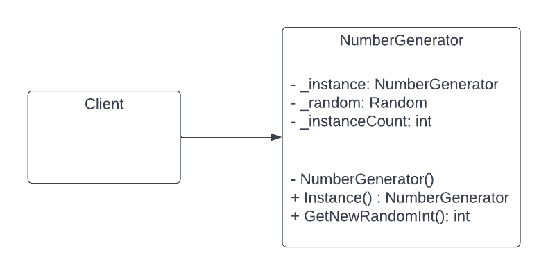

# The Singleton Design Pattern
The Singleton design pattern ensures an object is created only once. This is achieved by use of a private constructor in the singleton class to prevent instantiation of a new object by way of using the *new* operator. Access to the singleton instance is achieved via a public static method. The instance itself is created when the public method is first called, and held in memory as a static variable.

## Example
This example demonstrates the use of the Singleton design pattern by creating a single instance of a NumberGenerator class. This class holds a single instance of a Random number generator which is reused every time a new random number is requested, and keeps track of how many times it creates itself by local private variables.

The single static instance of the NumberGenerator class is accessed via a public static Instance() method which ensures the NumberGenerator and the Random object it contains are only instantiated once.

## UML

